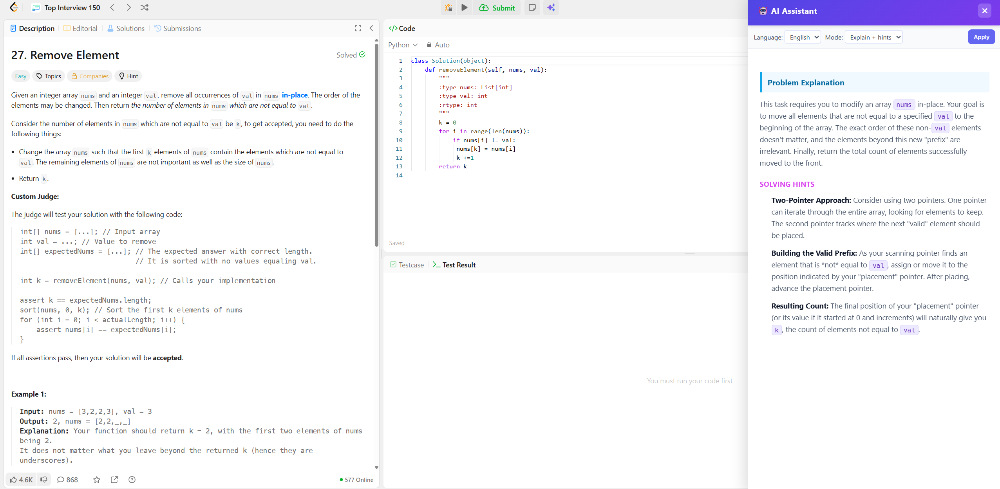
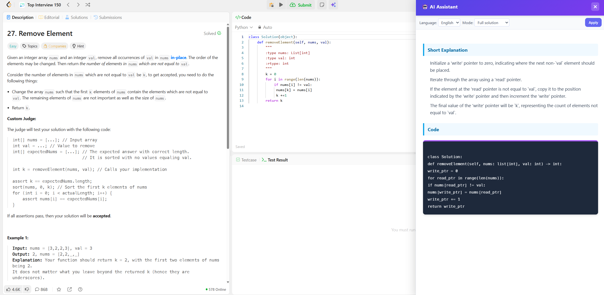

# LeetCode AI Helper – Chrome Extension

A Chrome extension that enhances the LeetCode coding experience by adding an AI-powered assistant directly into the interface.

## 🚀 What does the extension do?

This tool allows you to:

✔ Right-click any text in a LeetCode problem → “Explain with AI”  
✔ Get a short, intuitive explanation of the problem  
✔ Receive solving hints and algorithms  
✔ Optionally generate a full solution in Python/Java/C++/etc  
✔ Choose the output language: English or Hebrew  
✔ Detect the code language automatically from LeetCode  
✔ Display results in a clean sidebar UI  
✔ Resize the sidebar freely  
✔ Toggle between modes: explanation / full solution  

This turns LeetCode practice into an interactive guided experience — like having a mentor sitting next to you.

## 🧩 Screenshots

### Explain + Hints Mode  

### Full Solution Mode  

## 🛠 Installation — Chrome Extension (Client)

1. Clone the repository:
   git clone https://github.com/BitBOY21/leetcode-ai-helper-chrome-extension.git

2. Open Chrome and go to:
   chrome://extensions/

3. Enable Developer Mode (top-right corner)

4. Click “Load unpacked”

5. Select the `extension/` folder

✔ The extension is now installed in your Chrome browser.

## 🖥 Running the Backend Server (Required)

1. Open terminal and navigate to backend folder:
   cd backend

2. Install dependencies:
   pip install fastapi uvicorn google-generativeai python-dotenv

3. Create a `.env` file inside the backend directory and add:
   GEMINI_API_KEY=YOUR_KEY_HERE

4. Start the backend server using:
   uvicorn server:app --reload

✔ Backend is now running at: http://127.0.0.1:8000
